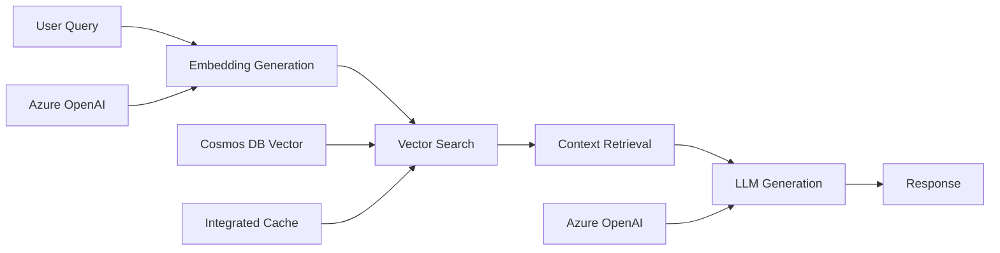

# Azure Cosmos DB AI Features Implementation Guide

This guide provides step-by-step instructions for implementing the latest AI-enhanced features in Azure Cosmos DB for NoSQL in your multi-tenant SaaS applications.

## Table of Contents
1. [Vector Database Implementation](#vector-database-implementation)
2. [Integrated Cache Setup](#integrated-cache-setup)
3. [Query Copilot Integration](#query-copilot-integration)
4. [RAG Pattern Implementation](#rag-pattern-implementation)
5. [Performance Optimization](#performance-optimization)
6. [Cost Management](#cost-management)

## Vector Database Implementation

### Prerequisites
- Azure Cosmos DB for NoSQL account
- API version 2024-05-15 or later
- Containers with vector indexing enabled

### Step 1: Enable Vector Search

Update your container's indexing policy to include vector indexes:

```json
{
    "indexingMode": "consistent",
    "automatic": true,
    "includedPaths": [
        {
            "path": "/*"
        }
    ],
    "excludedPaths": [
        {
            "path": "/_etag/?"
        }
    ],
    "vectorIndexes": [
        {
            "path": "/vectorProperty",
            "type": "diskANN"
        },
        {
            "path": "/descriptionEmbedding",
            "type": "diskANN"
        }
    ]
}
```

### Step 2: Store Vector Data

Design your documents to include vector embeddings:

```json
{
    "id": "hotel-recommendation-1",
    "tenantId": 1001,
    "type": "AIRecommendation",
    "description": "Luxury oceanfront suite with premium amenities",
    "vectorProperty": [0.1, 0.2, 0.3, ...], // 768 or 1536 dimensions typical
    "metadata": {
        "roomType": "Suite",
        "amenities": ["spa", "ocean-view"],
        "priceRange": "luxury"
    }
}
```

### Step 3: Perform Vector Queries

Use the VectorDistance function for similarity search:

```sql
SELECT c.id, c.description, c.metadata,
       VectorDistance(c.vectorProperty, [0.1, 0.2, 0.3, ...]) AS similarity
FROM c 
WHERE c.type = 'AIRecommendation'
ORDER BY VectorDistance(c.vectorProperty, [0.1, 0.2, 0.3, ...])
OFFSET 0 LIMIT 10
```

### Best Practices for Vector Search

1. **Vector Dimensions**: Use consistent dimensions (768, 1536, etc.)
2. **Normalization**: Normalize vectors for cosine similarity
3. **Partition Strategy**: Include vector searches within partition boundaries when possible
4. **Indexing**: Only create vector indexes on properties you'll query

## Integrated Cache Setup

### Step 1: Provision Dedicated Gateway

1. Navigate to your Cosmos DB account in Azure Portal
2. Go to Settings > Dedicated Gateway
3. Configure:
   - **SKU**: Choose based on your workload (D4s recommended for production)
   - **Instance Count**: Start with 1, scale based on needs
   - **Region**: Same as your primary region

### Step 2: Update Connection Strings

Replace your standard connection string with the dedicated gateway connection string:

```csharp
// C# Example
var cosmosClientOptions = new CosmosClientOptions()
{
    ConnectionMode = ConnectionMode.Gateway, // Required for cache
    ConsistencyLevel = ConsistencyLevel.Session
};

var client = new CosmosClient(dedicatedGatewayConnectionString, cosmosClientOptions);
```

```python
# Python Example
client = CosmosClient(dedicated_gateway_connection_string, connection_mode="Gateway")
```

### Step 3: Configure Cache Staleness

Set appropriate cache staleness for your use cases:

```csharp
var requestOptions = new ItemRequestOptions
{
    MaxIntegratedCacheStaleness = TimeSpan.FromMinutes(5) // Adjust based on requirements
};

var response = await container.ReadItemAsync<T>(id, partitionKey, requestOptions);
```

### Cache Strategy Guidelines

| Use Case | Recommended Staleness | Notes |
|----------|----------------------|-------|
| User Profiles | 5-10 minutes | Moderate staleness acceptable |
| Product Catalog | 30-60 minutes | Static data, longer cache OK |
| Real-time Pricing | 30 seconds | Frequent updates needed |
| Analytics Data | 1-5 minutes | Balance performance vs accuracy |

## Query Copilot Integration

### Step 1: Enable Preview Feature

1. Enroll your Azure subscription in the Microsoft Copilot for Azure preview
2. Navigate to Data Explorer in your Cosmos DB account
3. Look for the Copilot interface in the query editor

### Step 2: Craft Effective Prompts

**Good Prompts:**
- "Show me all hotel reservations for tenant 1001"
- "Find luxury rooms with rates above $300"
- "Count reservations by room type for the last month"

**Avoid:**
- Ambiguous language
- Overly complex requests
- Queries spanning multiple containers without context

### Step 3: Validate Generated Queries

Always review generated queries before execution:

```sql
-- Generated by Copilot for "Find high-rated luxury rooms"
SELECT c.id, c.roomType, c.rating, c.priceRange
FROM c 
WHERE c.type = 'Room' 
AND c.priceRange = 'luxury' 
AND c.rating >= 4.5
ORDER BY c.rating DESC
```

## RAG Pattern Implementation

### Complete RAG Architecture



### Step 1: Generate Embeddings

```python
import openai
from azure.identity import DefaultAzureCredential

# Configure Azure OpenAI
credential = DefaultAzureCredential()
openai.api_type = "azure"
openai.api_base = "https://your-openai.openai.azure.com/"
openai.api_version = "2024-02-01"

def generate_embedding(text: str) -> List[float]:
    response = openai.Embedding.create(
        engine="text-embedding-ada-002",
        input=text
    )
    return response['data'][0]['embedding']
```

### Step 2: Store with Embeddings

```python
async def store_with_embedding(container, document: dict):
    # Generate embedding for description
    embedding = generate_embedding(document['description'])
    document['descriptionEmbedding'] = embedding
    
    # Store in Cosmos DB
    await container.create_item(document)
```

### Step 3: Retrieve Context

```python
async def retrieve_context(container, query: str, limit: int = 5):
    # Generate query embedding
    query_embedding = generate_embedding(query)
    
    # Vector search
    vector_query = f"""
        SELECT c.id, c.description, c.metadata,
               VectorDistance(c.descriptionEmbedding, {json.dumps(query_embedding)}) AS similarity
        FROM c 
        WHERE c.type = 'Knowledge'
        ORDER BY VectorDistance(c.descriptionEmbedding, {json.dumps(query_embedding)})
        OFFSET 0 LIMIT {limit}
    """
    
    results = []
    async for item in container.query_items(query_vector_query, enable_cross_partition_query=True):
        results.append(item)
    
    return results
```

### Step 4: Generate Response

```python
async def generate_rag_response(query: str, context: List[dict]) -> str:
    # Build prompt with context
    context_text = "\n".join([item['description'] for item in context])
    
    prompt = f"""
    Based on the following context about hotels and accommodations:
    
    {context_text}
    
    Please answer this question: {query}
    
    Provide a helpful and accurate response based only on the provided context.
    """
    
    response = openai.ChatCompletion.create(
        engine="gpt-4",
        messages=[{"role": "user", "content": prompt}],
        temperature=0.1
    )
    
    return response.choices[0].message.content
```

## Performance Optimization

### Vector Search Optimization

1. **Dimension Optimization**: Use appropriate vector dimensions
   - 768 dimensions: Good balance of accuracy and performance
   - 1536 dimensions: Higher accuracy, more storage/compute

2. **Query Optimization**:
   ```sql
   -- Optimized: Include partition key when possible
   SELECT c.id, VectorDistance(c.embedding, @vector) AS similarity
   FROM c 
   WHERE c.tenantId = @tenantId  -- Partition key filter
   AND c.type = 'Recommendation'
   ORDER BY VectorDistance(c.embedding, @vector)
   ```

3. **Indexing Strategy**:
   - Only index vectors you'll search on
   - Consider separate containers for different vector types

### Cache Optimization

1. **Hit Rate Monitoring**:
   ```sql
   -- Monitor cache metrics in Azure Monitor
   IntegratedCacheItemHitRate > 0.7  -- Target 70%+ hit rate
   IntegratedCacheQueryHitRate > 0.7
   ```

2. **Staleness Tuning**:
   - Start conservative (30 seconds)
   - Gradually increase based on business requirements
   - Monitor data freshness requirements

3. **Cache Size Planning**:
   - D4s: 16 GB cache (good for most workloads)
   - D8s: 32 GB cache (high-volume scenarios)
   - Monitor `IntegratedCacheEvictedEntriesSize`

## Cost Management

### Cost Optimization Strategies

1. **Free Tier Benefits**:
   - 1,000 RU/s permanent free tier
   - 25 GB storage free
   - Perfect for development/testing

2. **Azure AI Advantage**:
   - 40,000 RU/s for 90 days
   - Up to $6,000 value
   - Available for Azure AI customers

3. **Cache ROI Calculation**:
   ```
   Cache Savings = (Cache Hit Rate × Read RU Cost × Read Volume) - Cache Cost
   
   Example:
   - 80% cache hit rate
   - 1000 reads/hour at 5 RU each
   - Cache cost: $50/month
   - Savings: (0.8 × 5 × 1000 × 24 × 30 × $0.00008) - $50 = $115.20/month
   ```

4. **Vector Storage Optimization**:
   - Store only necessary vector dimensions
   - Use appropriate data types
   - Consider vector compression for large datasets

### Monitoring and Alerts

Set up Azure Monitor alerts for:

1. **RU Consumption**: Alert on unexpected spikes
2. **Cache Hit Rate**: Alert if below 70%
3. **Query Performance**: Monitor P95 latency
4. **Storage Growth**: Track vector storage usage

## Sample Implementations

### Multi-tenant Vector Search

```csharp
public async Task<List<Recommendation>> GetRecommendationsAsync(
    int tenantId, 
    float[] userPreferences, 
    int limit = 10)
{
    var vectorQuery = $@"
        SELECT c.id, c.description, c.metadata,
               VectorDistance(c.preferenceVector, {JsonConvert.SerializeObject(userPreferences)}) AS similarity
        FROM c 
        WHERE c.tenantId = {tenantId}
        AND c.type = 'Recommendation'
        ORDER BY VectorDistance(c.preferenceVector, {JsonConvert.SerializeObject(userPreferences)})
        OFFSET 0 LIMIT {limit}";

    var requestOptions = new QueryRequestOptions
    {
        MaxIntegratedCacheStaleness = TimeSpan.FromMinutes(5), // Cache for 5 minutes
        PartitionKey = new PartitionKey(tenantId) // Optimize for single partition
    };

    var results = new List<Recommendation>();
    using var iterator = container.GetItemQueryIterator<Recommendation>(vectorQuery, requestOptions: requestOptions);
    
    while (iterator.HasMoreResults)
    {
        var response = await iterator.ReadNextAsync();
        results.AddRange(response);
    }

    return results;
}
```

### Cached Analytics Query

```python
async def get_tenant_analytics(container, tenant_id: int, cache_minutes: int = 10):
    query = """
        SELECT 
            c.type,
            COUNT(1) as count,
            AVG(c.score) as avgScore
        FROM c 
        WHERE c.tenantId = @tenantId
        GROUP BY c.type
    """
    
    # Use cache for analytics
    parameters = [{"name": "@tenantId", "value": tenant_id}]
    
    results = []
    async for item in container.query_items(
        query=query,
        parameters=parameters,
        enable_cross_partition_query=False  # Single partition query
    ):
        results.append(item)
    
    return results
```

## Troubleshooting

### Common Issues

1. **Vector Search Not Working**:
   - Verify vector index is created
   - Check vector dimensions match
   - Ensure API version 2024-05-15+

2. **Cache Not Working**:
   - Use dedicated gateway connection string
   - Set ConnectionMode to Gateway
   - Verify session/eventual consistency

3. **Poor Performance**:
   - Check partition key strategy
   - Monitor RU consumption
   - Optimize vector dimensions

### Support Resources

- [Azure Cosmos DB Documentation](https://docs.microsoft.com/azure/cosmos-db/)
- [Vector Search Samples](https://github.com/Azure-Samples/cosmos-db-nosql-vector-search)
- [Community Forums](https://techcommunity.microsoft.com/t5/azure-cosmos-db/bd-p/AzureCosmosDB)
- [GitHub Issues](https://github.com/Azure/azure-cosmos-dotnet-v3/issues)

## Next Steps

1. **Implement Vector Search**: Start with a simple use case
2. **Enable Integrated Cache**: Set up dedicated gateway
3. **Try Query Copilot**: Experiment with natural language queries
4. **Build RAG Application**: Integrate with Azure OpenAI
5. **Monitor and Optimize**: Use Azure Monitor for insights

This guide provides a comprehensive foundation for implementing AI-enhanced features in Azure Cosmos DB. Adapt the examples to your specific multi-tenant architecture and use cases.
